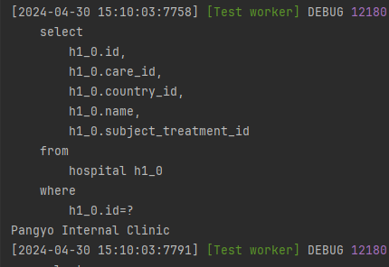
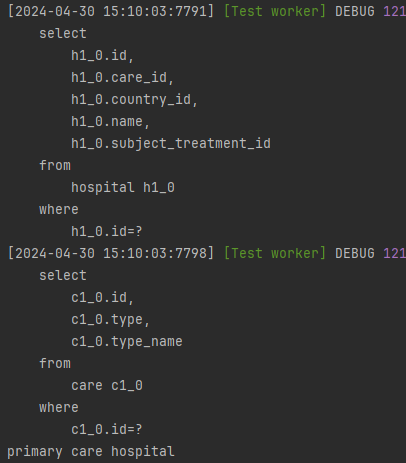
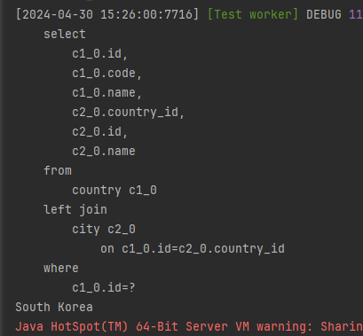

There is quite a difference between selecting from SQL to NoSQL databases. Moreover, there are significant differences between a associated table schema and a normalized schema.

### Associated Tables
- Associated table hold keys from two or more related table's. It "Associates" relations. So if this table is lost, there is no way one can figure out each table's relations.
- Associated tables are commonly used when two or more tables have a @Many To Many relations but not limited.
- Associated tables are used when each table has its own perspective on the data values. Meaning it is architected to only store data values of its characteristics.
  - ex) If there are two tables called "Book" and "Author", "Book" only store column and data values representing "Book", so as it is for the "Author". 
- Following up with the third statement, due to it having its own perspective, it is also commonly used to resolve complexity relationships between tables. They streamline the representation of relationships without introducing data redundancy.
- Furthermore, using associated tables simplify complex queries and accommodates to a flexible data models

### Normalized Tables 
- Normalized tables, rather having associated tables for each (tables), each table with a relation to another contains their information and index values.
- Normalized tables have strict relational integrity with each tables due to the use of key constraints. It ensures consistency and accuracy in data relationships.
- Normalized tables are used to organize data efficiently by minimizing redundancy and reducing update anomalies, leading to improved data consistency and integrity.
- Therefore, it may introduce to query complexity and potential performance overhead due to joins across normalized tables.
  - Denormalization) In certain cases, denormalization may be necessary to optimize performance or simplify queries.

In my view, while both associated tables and normalized tables offer valuable approaches to organizing relational data, the choice between them ultimately depends on the specific requirements and constraints of each project. While normalized tables prioritize data consistency and integrity, associated tables offer flexibility and simplicity in managing complex relationships. Additionally, judicious use of denormalization can help optimize performance without sacrificing data integrity. Ultimately, a balanced approach that considers the trade-offs and benefits of each method is essential for effective database design.

### JPA, QueryDSL, MyBatis
As we discussed the specific strategy behind associated and normalized tables, lets compare the difference when it comes to JPA, QueryDSL, MyBatis mechanisms.

### JPA fetch types
There are many ways to fetch data when it comes to JPA relation mapping.
We have lazy fetch and eager fetch.
1. Lazy fetch
   - Lazy fetch can be used in multiple occasions. Say you have a Hospital table that has relations with tables of Country, SubjectTreatment, Care. For specific occasions, there may not or maybe times when you will need to call their related classes. 
   Calling their classes by `hospital.getCare()` JPA will execute a `+1` query inorder for it to know which Care data you are trying to retrieve for the following Hospital Id. Lazy fetch comes in to play when ones target is to use a entity relations dynamically. 
    </br>
    The bottom test query execution results as the following.
    </br>
        ```java
        @Test
        @Transactional(readOnly = true)
        void NormalizedDatabaseLazyFetchNonCall () throws Exception {
            Hospital hospital = hospitalInteract.findById(1L);
            System.out.println(hospital.getName());
        }
        ```
        
        ```java
        @Test
        @Transactional(readOnly = true)
        void NormalizedDatabaseLazyFetchCall () throws Exception {
            Hospital hospital = hospitalInteract.findById(1L);
            System.out.println(hospital.getCare().getTypeName());
        }
        ```
        
    </br> 
2. Eager fetch
   - Regardless of the dynamic entity calling, there might be time when you need to use all the related entities. </br> 
   Hospital has a relations with Country of many to one, Country has a relation with City one to many. Having the Country (Mapped in Hospital) fetch type to `Lazy` and having the City fetch type (Mapped in Country) to Eager will result as the following.
   </br>
       ```java
       @Order(3) 
       @DisplayName("Normalized - Eager fetch call")
       @Test 
       @Transactional(readOnly = true)
       void NormalizedDatabaseEagerFetchCall () throws Exception {
           Hospital hospital = hospitalInteract.findById(1L);
           System.out.println(hospital.getCountry().getName());
       }
       ```
      
   </br> Regardless of not calling cities entity in Country, Eager fetch will intuitively call all the related City entities along when Country is called.